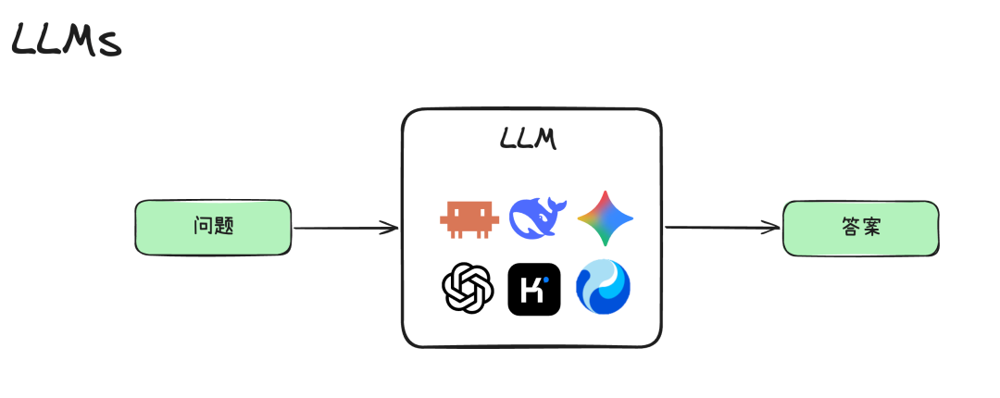

# 第 1 课：一次模型调用与运行时边界

**问题。** `answer = llm(question)` 看起来完成问答，却没有说明是谁保存历史、限制步数、执行动作。当前仓库的 `Agent` 更像反过来的极端：循环已经有了，但 `DemoDecider` 不是真实模型，也没有行动能力。先把两者的职责说清，后面才不会把“模型生成文字”误认为“程序做了事情”。

*图源：[腾讯程序员原文](https://mp.weixin.qq.com/s/kZZac-VBgnQIZeookE9Y8g)，这里只用它说明单次调用的形态。*

## 拆开一轮调用

模型接口只接收本轮提交的输入并返回输出；跨轮状态在程序中。即使模型“说”自己会查看文件，也不会因此自动发生文件读取。写一张两列清单：模型可决定的内容（例如回答文本、稍后的工具调用意图）与运行时必须决定的内容（调用次数、何时停止、哪些工具可用、是否真正执行）。

## 动手实验

1. 运行 `python3 -m agent_from_zero "统计仓库中的 Python 文件"`，逐行追踪 `__main__.py` → `Agent.run()` → `DemoDecider.decide()`。记下 `history` 在两次调用前分别是什么。
2. 把 `DemoDecider` 临时改成永远返回 `Continue("还在继续")`，使用 `max_steps=2` 运行；解释为什么状态是 `step_limit`，为什么目录中没有文件被读取。实验结束后还原改动。
3. 给 `RunResult` 画出最小状态图：`running → finished` 或 `running → step_limit`。标出模型/决策器与循环各自负责的边。

**验收。** 能仅凭实际输出证明“`finished` 表示循环结束，不表示用户任务完成”。保存两次运行输出；运行 `python3 -m unittest discover -s tests -v`。本课不接 API，不新增工具。

**延伸。** 读 [Anthropic《Building effective agents》](https://www.anthropic.com/engineering/building-effective-agents) 对预定义工作流和由模型自主选择动作的 Agent 的区分。下一课把 `Decider` 背后的假输出换成清楚的模型调用边界。
