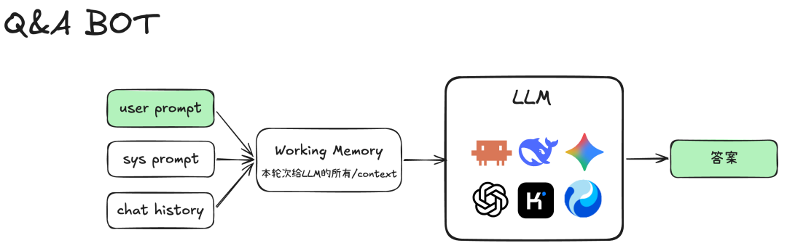

# 第 2 课：先让它能连续聊天

第 1 课的程序回答一句就退出。现在只加一个循环：用户可以反复输入，程序每次调用模型并显示回答。今天**仍然只发送当前这一句**，故意不保存历史。这有助于你分清“程序能连续运行”和“模型能看见之前的对话”是两回事。



*图源：[腾讯程序员原文](https://mp.weixin.qq.com/s/kZZac-VBgnQIZeookE9Y8g)。图里包含历史装配；本课先完成外层循环，第 3 课再补历史。*

## 什么在重复

把第 1 课的“输入 → 请求 → 输出”放进 `while` 循环。设计两个确定规则：输入 `/exit` 结束程序；空输入不调用模型，继续等待。先不要把网络调用写成递归函数，也不要引入任务步数上限。此时每次用户发言都是独立的一轮。

```text
程序启动
  └─ 等待用户输入
       ├─ /exit → 退出
       ├─ 空行 → 继续等待
       └─ 普通文本 → 请求模型 → 显示 → 回到等待
```

## 动手与观察

1. 修改你自己的 `main.py`，保留第 1 课的模型请求写法，只把输入与调用放进循环。
2. 连续输入“我叫小吴”和“我叫什么”。第二次请求的 JSON 里检查 `messages`：如果仍只有“我叫什么”，模型没有获得名字。它偶尔猜对也不能证明程序有记忆。
3. 输入空行和 `/exit`，检查是否分别不发送请求、正常退出。给每次模型调用编号，确认空行不增加编号。

## 完成标准

同一进程里能连续问至少三句；`/exit` 能退出；你能展示第二次发送的请求仍只有一条用户消息。**这已经是一个能对话的最简程序**，但还不是会利用对话历史的程序。

**下一课的问题：** 怎么让“我叫什么”真正看到“我叫小吴”？答案不是改模型参数，而是程序自己保留并重新提交历史。
