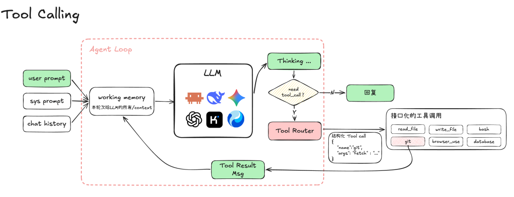

# 第 7 课：让模型提出一次工具调用

第 6 课由终端菜单决定调用工具。现在换成模型提出意图，但只做**一次调用、一次结果、一次继续请求**，暂时不写自动循环。这一停顿很重要：你要亲眼看到模型输出、程序执行、观察返回三个阶段。



*图源：[腾讯程序员原文](https://mp.weixin.qq.com/s/kZZac-VBgnQIZeookE9Y8g)。本课只接一个只读工具，不照图中一次实现所有工具。*

## 修改你自己的模型接口

第 4 课的 `reply(messages) -> text` 不足以表达工具调用。现在把返回值扩展为“文本回答**或**结构化工具请求”。Ollama 的 Chat API 请求可带 `tools`；模型响应可能包含 `message.tool_calls`。程序把工具描述交给模型，随后验证工具名和参数，路由到第 6 课的实现，再把 `tool` 消息作为下一次请求的一部分发回模型。[官方工具调用示例](https://docs.ollama.com/capabilities/tool-calling)展示了这两次请求的形态。

```text
用户：读取 stats.py，告诉我平均值函数用了什么运算
第 1 次模型响应：请求 read_file(path="stats.py")
程序：校验并读取 → 返回工具结果
第 2 次模型请求：原始问题 + 工具调用记录 + 工具结果
第 2 次模型响应：根据真实文件内容回答
```

不要把模型输出的普通文字当 shell 命令，也不要因为它说“我需要读文件”就猜出调用。只有合法的结构化调用才进入路由器。若模型直接给出回答，本课就展示回答，并记录它没有实际读取文件。

## 动手实验

1. 给 `read_file` 定义工具名称、描述和 `path` 参数模式；让所选本地模型尝试调用。不同模型的工具调用表现可能不同，先检查原始响应形状。
2. 用 `FakeModel` 固定返回一次合法调用、一次未知工具、一次坏参数。检查只有合法调用使文件读取函数运行。
3. 确保第二次模型请求里有与这次调用对应的工具结果，而不只是把结果打印到终端。

**完成标准：** 能在轨迹里指出“模型提出的动作”“程序实际执行的动作”“返回给模型的观察”。到此只处理一次动作；想让模型继续读第二个文件，第 8 课由你亲手写运行循环。
