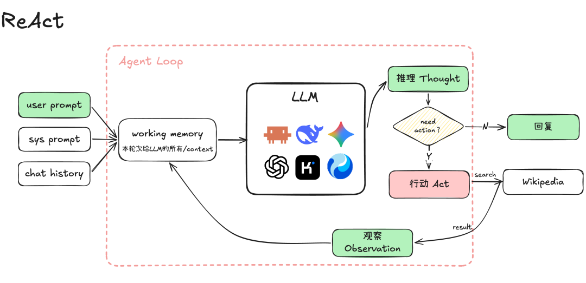

# 第 8 课：亲手写 Agent 的任务运行循环

第 7 课的程序可以完成“工具调用 → 再问一次模型”，但如果第二次模型又要用工具，流程就断了。现在才写核心 `run_task`：在一次用户任务内部反复请求模型、执行合法工具、送回观察，直到模型给出最终回答或达到停止条件。这是你自己的第一版 **Agent run loop**。



*图源：[腾讯程序员原文](https://mp.weixin.qq.com/s/kZZac-VBgnQIZeookE9Y8g)。图中的 Thought 是概念标签；课程不要求展示或保存模型私有推理。*

## 与第 2 课的循环有什么不同

第 2 课的外层循环每次都在**等用户下一句**；本课的内层循环在同一任务内继续工作，用户暂时没有发新消息。`run_task(user_message)` 最终返回一次任务结果；外层对话循环再等待新输入。这两层可以先分开写、分开测试，不必做复杂类层次。

```text
外层：等待用户输入
       └─ run_task(本轮任务)
            ├─ 请求模型
            ├─ 最终文本？→ 结束这一轮任务
            └─ 工具请求？→ 验证 → 执行 → 记录观察 → 再请求模型
```

## 亲手实现

1. 先用 `FakeModel` 排定三次响应：读 `stats.py`、读 `test_stats.py`、总结“整数除法导致测试失败”。把每次工具结果加入本轮消息，再请求模型。
2. 加 `max_steps`，明确它数的是**模型决策次数**。假模型若永远要求读同一文件，应在上限停止，返回 `step_limit`，不能假装任务成功。
3. 一次模型响应若有多个调用，第一版按顺序处理并逐个记录结果。对话历史、当前任务消息与本轮工具观察可以先放在一个有序列表中，但要能解释每条来自哪里。
4. 最后再接真实本地模型。模型是否一定采取你期望的路径不由代码保证；循环是否按返回类型正确运行由假模型测试保证。

**完成标准：** 固定轨迹中至少有两次模型请求、一次工具执行、一次结果回填；最终文本来自模型对工具结果的后续回答。达到上限时停止新工具调用。现在它才是能依据环境反馈行动的 Agent。

**阅读。** [ReAct 论文](https://arxiv.org/abs/2210.03629)提供“行动与观察交错”的研究背景；本课实现的是最小工程闭环。
