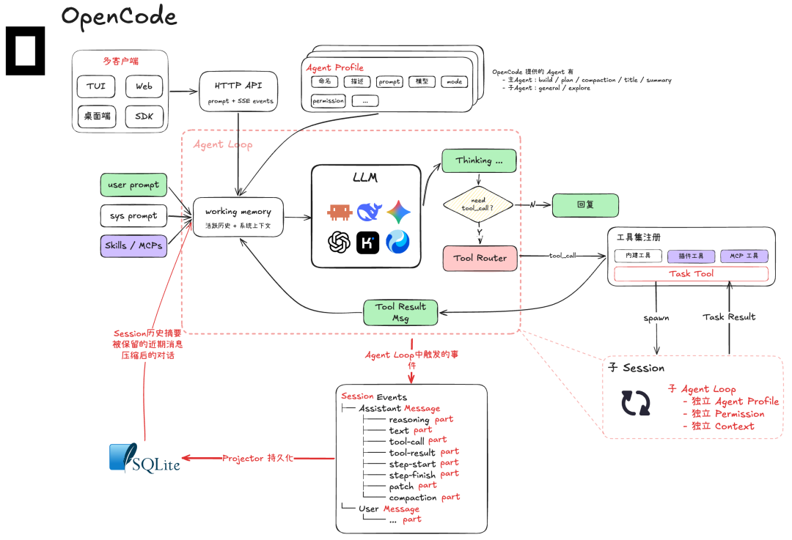

# 第 10 课：把一次任务记录成可以检查的事件

第 9 课已有停止原因，但如果只在终端打印几行文字，关闭窗口后很难知道某次工具究竟何时开始、何时完成。现在引入最小的会话与事件记录，先解决**可观察**，还不声称已经能恢复执行。

*图源：[腾讯程序员原文](https://mp.weixin.qq.com/s/kZZac-VBgnQIZeookE9Y8g)。这里只借图说明事件与终端显示分离，不复制其当前内部实现。*

## 三层编号

`session_id` 指一次持续对话；`turn_id` 指用户发起的一轮任务；`call_id` 指模型在这轮里提出的一次工具调用。记录至少包括：用户提交、模型返回、工具开始、工具完成、任务停止。每条事件有递增序号和版本号；保存为 JSONL 即可，不急着上数据库。

一次读文件可能留下 `tool_started(call_id=c1)` 和 `tool_completed(call_id=c1, status=ok)`。如果文件末尾只有开始事件，能够确定的是“开始过、结果未记录”，不能把它当成成功或失败。

## 动手实验

1. 跑第 8 课的任务，保存一份事件文件；另写一个只读查看命令，从事件重建人能读懂的轨迹。查看时不得再次请求模型或执行工具。
2. 人为删除最后一个完整事件，检查查看器能指出缺少完成记录。
3. 人为截断 JSONL 最后一行；查看器报告尾部损坏，并保留之前的完整事件。

**完成标准：** 从事件回答“哪个调用已经开始、哪个已经完成、任务为什么停止”。终端输出可以重画，但事件顺序不能因显示方式变化而丢失。

**源码阅读。** 可按选定版本查看 [OpenCode](https://github.com/anomalyco/opencode) 怎样表示消息与工具事件。原文图是概念图，不是本项目已经实现的功能清单。
