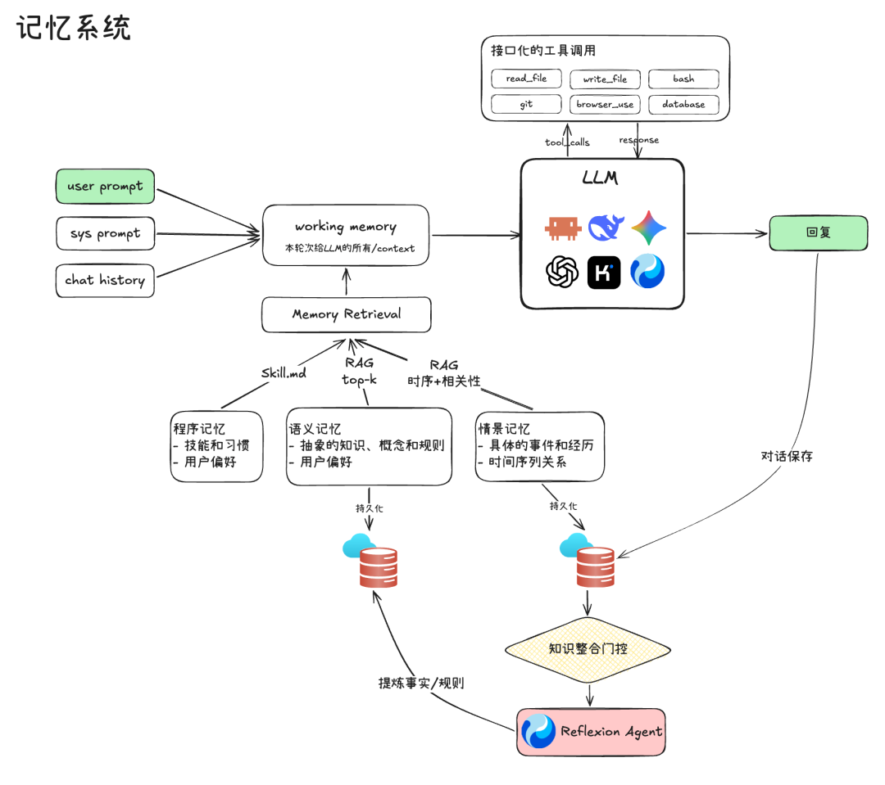

# 第 14 课：跨会话记住什么，由谁决定

第 13 课的摘要帮助当前任务继续，但新会话不应把旧任务的所有日志塞进模型。用户明确的稳定偏好、项目约定、经过验证的流程，才可能值得跨会话保留。错误工具结果不能自动升级为“长期事实”。

*图源：[腾讯程序员原文](https://mp.weixin.qq.com/s/kZZac-VBgnQIZeookE9Y8g)。图展示多种可能的记忆形式，本课先做简单文件存储。*

## 第一版不用向量数据库

把记忆写成带 `id、内容、来源事件、类型、写入时间、版本、状态` 的 JSON 或 Markdown。候选写入前判断：用户是否明确说过？能否追溯来源？与旧值是否冲突？是否包含秘密？检索时先用关键词，并把来源一起送入上下文。检索来的内容仍是低于用户当前要求的资料，不能当成新的系统指令。

## 动手实验

1. 会话 A 中用户说“以后测试命令用 `python3`”；新会话 B 检索并使用这一偏好，但不加载 A 的完整历史。
2. 会话 C 中用户纠正偏好；旧版本保留变更记录，新版本生效。
3. 将“某次文件暂时不存在”作为候选记忆，验证它不会自动变成稳定项目事实；无来源的伪记忆默认不注入。

**完成标准：** 每条被使用的记忆都能回答“从哪来、何时生效、是否被更新、为什么这次被检索”。对同一道跨会话任务比较有无记忆的真实行为。

**阅读。** [RAG](https://arxiv.org/abs/2005.11401)与 [MemGPT](https://arxiv.org/abs/2310.08560)提供外部知识与分层存储的思路；本课的写入规则仍由你自己设计。
