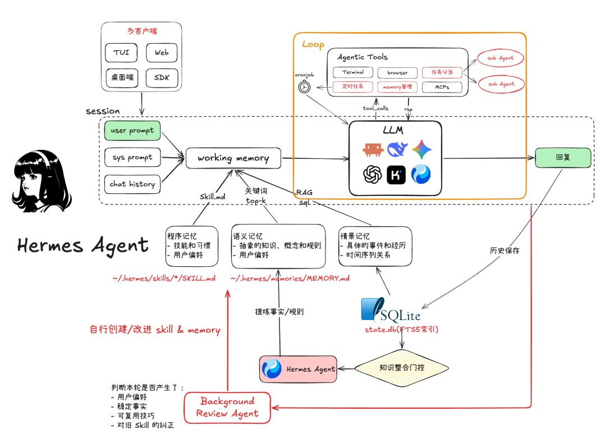

# 第 14 课：子 Agent 要有自己的边界

**上一版的失败。** 一个编码任务同时做检索、修改和审查，所有信息堆进同一上下文会增加噪声，权限也容易混淆。直接把主循环复制一份、共用历史和工具集，并不形成隔离。

*图源：[腾讯程序员原文](https://mp.weixin.qq.com/s/kZZac-VBgnQIZeookE9Y8g)。这里只借图中的任务分派位置讨论子任务；图上的长期记忆能力不属于本课已实现内容。*

## 只做一种子任务

先定义 `explore`：父任务传入目标、允许读取的路径与预算；子任务有独立的 `session_id`、上下文、事件日志、步数上限和**只读**工具集。返回的是带来源的发现摘要，而不是把整个子任务历史硬塞回父上下文。父任务要知道摘要来自哪个子任务和哪些文件。

推荐的交接对象包含 `child_id、task、status、findings、evidence_refs、cost`。其中 `findings` 可以是“`stats.py` 第 7 行使用整数除法”，但 `evidence_refs` 必须指向实际读取记录；父任务不能把子任务的猜测当成已验证事实。若子任务没有找到证据，结果应写“不确定”而不是编造路径。

## 动手实验

1. 让父任务询问“这个 bug 可能在哪里”，派发 `explore`，子任务读取练习项目后返回文件路径、相关行与不确定点。
2. 在子任务中请求写入，检查工具注册表与权限策略都拒绝；父任务即使有写权限，也不能被子任务继承。
3. 注入子任务超时与失败；父任务应收到结构化状态，可以继续或向用户解释，而不是失去自己的上下文。

**验收。** 轨迹能追溯父子关系、预算和工具边界。用同一个固定任务比较单 Agent 与子 Agent 的成功情况、调用次数、延迟和上下文大小；如果没有收益，也要如实记录。并行调度不是本课的前提，先串行完成正确性。

**阅读。** [Anthropic《Building effective agents》](https://www.anthropic.com/engineering/building-effective-agents) 的编排模式可作为对照。
