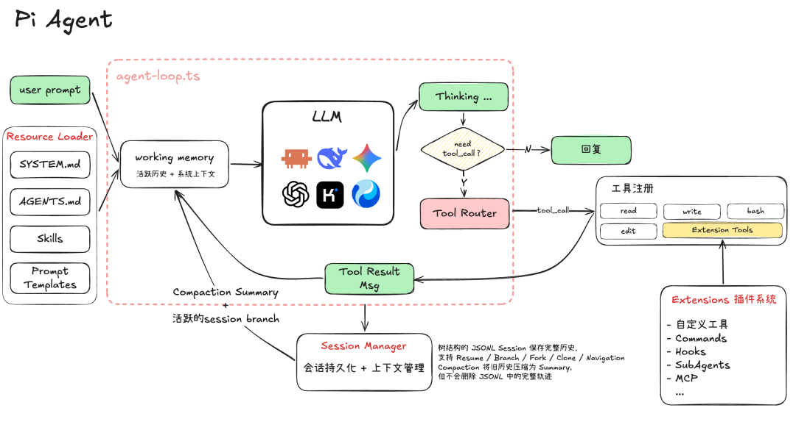

# 第 15 课：把能力装进来，而不是写死在核心循环

到第 14 课为止，工具、提示说明和记忆的来源都由你自己的代码决定。现在学习两种不同的扩展方式：**Skill** 提供可选择装入的工作说明，**MCP** 让运行时连接外部工具或资源服务。二者都不应绕过第 11 课的权限边界。

*图源：[腾讯程序员原文](https://mp.weixin.qq.com/s/kZZac-VBgnQIZeookE9Y8g)。这里只借图理解“显式装配”，不要求复刻 Pi。*

## 先分清三件事

Skill 是可以进入模型上下文的流程文字；Tool 是可以由程序执行的动作；MCP 是连接工具和资源的协议。加载一段“修 bug 时先读测试”的说明，不会自动给模型写文件能力；MCP 服务公布了工具，也不代表本地策略已经允许调用。

## 动手实验

1. 写一个最小的本地 Skill 说明，显式记录何时被选择、从哪个文件加载、占用多少上下文。关闭 Skill 后，检查本轮模型输入的差别。
2. 连接一个本地、只读的 MCP 服务，把它的一个工具映射到你已有的工具路由器；使用相同的参数检查、结果记录与权限策略。
3. 故意断开服务，再请求工具。Agent 应收到清楚的错误，不能假装拿到了结果。

**完成标准：** 能指出“说明何时加载”“工具何时注册”“模型何时提议调用”“程序何时真正执行”。MCP 工具不能因为来自外部服务就跳过本地校验。

**阅读。** [MCP 官方规范](https://modelcontextprotocol.io/specification/2025-11-25)。实现时明确客户端和服务端所用的规范版本，不把文章里的示意结构当作协议细节。
